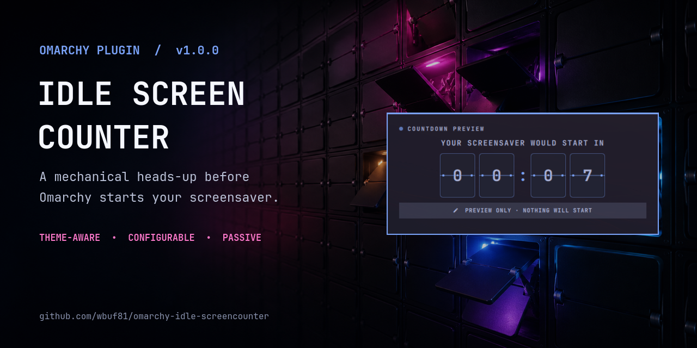
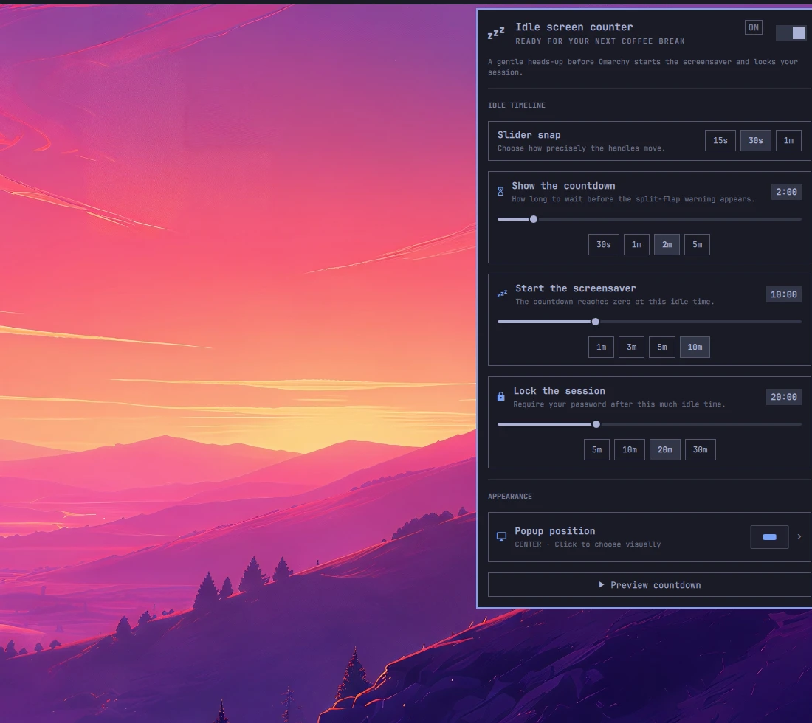
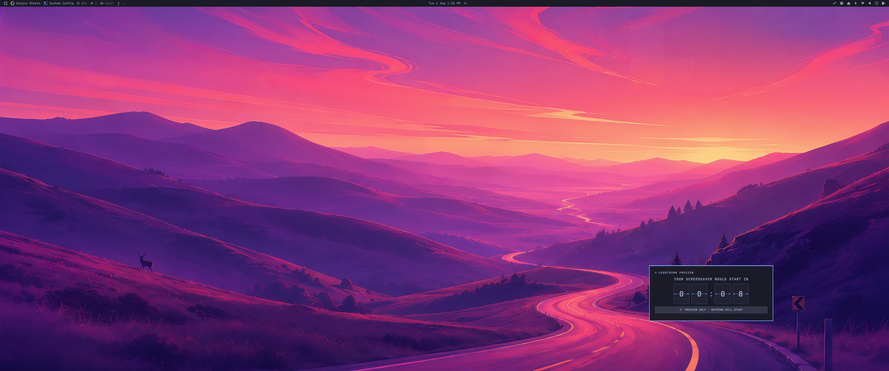
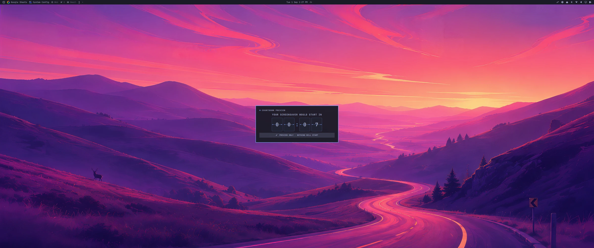

<div align="center">
  

  <br>

  <a href="https://omarchy.org/"></a>
  <a href="https://quickshell.org/"></a>
  <a href="https://github.com/wbuf81/omarchy-idle-screencounter/actions"></a>
  <a href="LICENSE"></a>

  <strong>A playful, passive heads-up before Omarchy starts your screensaver.</strong>
</div>

Idle Screen Counter is a native Omarchy shell plugin with an old railway-board
soul. After a configurable amount of idle time, it floats above your work and
counts down on mechanical split-flap tiles. Move the mouse or press a key and it
vanishes instantly.

It does not dim the desktop, block clicks, steal focus, or replace Omarchy's
screensaver and lock services. It simply makes the transition visible—and much
more fun.

<div align="center">
  
  <br>
  <sub><a href="assets/demo/idle-screen-counter-demo-clean.mp4">Watch the full-quality 60 fps MP4</a></sub>
</div>

## Why it feels native

- **Actually theme-aware.** Popup surfaces, text, borders, spacing, corner
  radii, fonts, controls, and the semantic countdown color come from the active
  Omarchy theme and update live.
- **Passive by design.** The full-screen layer has an empty input region, so
  every click and key reaches the application underneath it.
- **One authoritative idle timeline.** Screensaver and lock controls update
  Omarchy's real idle configuration instead of running a competing scheduler.
- **Respectful of the system.** Stay Awake and standard idle inhibitors disarm
  the warning along with Omarchy's own screensaver.
- **Delightfully mechanical.** Each changing character collapses into its
  hinge, drops the next lower flap, rebounds, and flashes the themed hinge.
- **Friendly to real desktops.** It follows the focused monitor, clamps popup
  positions to smaller outputs, and supports seven visual landing spots.

## The default ride

```text
0:00                     2:00                         10:00                    20:00
  ├── normal activity ────┼── split-flap countdown ────┼── screensaver ─────────┤
                          │          08:00 → 00:00      │       10 minutes       │
                          └── popup appears             └── starts               └── lock
```

| Event | Default | Configurable range |
| --- | ---: | ---: |
| Show countdown | 2 minutes idle | 15 seconds–15 minutes |
| Start screensaver | 10 minutes idle | 30 seconds–30 minutes |
| Lock session | 20 minutes idle | 45 seconds–60 minutes |

The values are deadlines measured from the beginning of inactivity—not delays
from the previous event. With the defaults, the popup is visible for eight
minutes and the screensaver runs for ten minutes before lock.

## Install

```sh
omarchy plugin add https://github.com/wbuf81/omarchy-idle-screencounter.git --enable
```

The `ZZZ` icon appears in the right side of the Omarchy bar. Click it to open
settings; right-click it for a fast visual-warning toggle.

Update later with:

```sh
omarchy plugin update io.github.wbuf81.idle-screencounter
```

Remove it with:

```sh
omarchy plugin remove io.github.wbuf81.idle-screencounter
```

## Make it yours

The settings panel is designed for experimentation rather than precision mouse
acrobatics:

- Choose whether sliders snap every **15 seconds**, **30 seconds**, or **one minute**.
- Jump instantly to useful presets below every slider.
- Watch the live time readout while dragging.
- Click **Popup position** to pick a location on an interactive mini desktop.
- Click **Preview countdown** to run the real ten-second flap animation. Preview
  mode is clearly labeled and never starts an idle action.
- Disable only the visual countdown without disabling Omarchy's normal
  screensaver or lock behavior.

The panel always preserves `warning < screensaver < lock`. Moving one deadline
through another automatically nudges the neighboring deadline to a valid value.

## Screenshots

| Settings that explain themselves | Pick where it lands |
| --- | --- |
|  |  |

<div align="center">
  
</div>

## Edge cases already handled

Release hardening covers the less glamorous situations too:

| Situation | Behavior |
| --- | --- |
| Mouse or keyboard activity | Popup disappears and the cycle resets immediately. |
| Omarchy Stay Awake | Warning monitor disarms and re-arms with the system service. |
| Idle inhibitor | The plugin and Omarchy both respect it. |
| Plugin warning switched off | Omarchy screensaver and lock remain active. |
| External `shell.json` edit | The panel reads authoritative live deadlines instead of restoring stale copies. |
| Lock manually configured before screensaver | Popup counts toward lock and changes its message accordingly. |
| Warning configured after the next idle event | It clamps to the final available second instead of inventing a later deadline. |
| Invalid placement or snap value | Falls back to center or 30-second snapping. |
| Countdown reaches zero | Its timer stops instead of running invisibly forever. |
| Multiple monitors | Only the focused output receives the card; the first output is the startup fallback. |
| Small output or edge placement | Offset is clamped so the card stays on-screen. |

## Local development

Omarchy intentionally rejects plugin symlinks. Use the included copy-and-rescan
helper for a tight development loop:

```sh
git clone https://github.com/wbuf81/omarchy-idle-screencounter.git
cd omarchy-idle-screencounter

./scripts/dev-sync.sh --enable  # first run
./scripts/dev-sync.sh           # every edit after that
```

Useful IPC commands:

```sh
omarchy-shell idle-screen-counter preview center
omarchy-shell idle-screen-counter preview bottom-right
omarchy-shell idle-screen-counter status
```

If the shell looks stale:

```sh
omarchy restart shell
```

## Validate and test

Pure timing/configuration logic lives in `Logic.js` and runs under Node without
touching the real idle service.

```sh
./scripts/static-check.sh   # manifest structure, files, shell syntax, logic tests
./scripts/release-check.sh  # everything above + native Omarchy plugin validation
```

The GitHub Actions workflow runs the static suite on every push and pull
request. The native release check is intentionally run on an Omarchy machine,
where the real plugin validator and QML environment exist.

Before a release, manually sanity-check:

- a real idle warning appears and activity dismisses it;
- Preview works while the visual warning switch is off;
- Stay Awake disarms and restores the plugin;
- one light and one dark theme remain readable;
- center and corner placement on every connected monitor;
- shell restart, plugin update, disable, re-enable, and removal.

## How it fits together

| File | Responsibility |
| --- | --- |
| `Service.qml` | Idle monitoring, preview, focused-monitor popup, and split-flap rendering |
| `BarWidget.qml` | Bar icon, panel loading, settings persistence, and Omarchy idle synchronization |
| `Panel.qml` | Native settings UI, snapping, presets, preview, and timeline editing |
| `PlacementPicker.qml` | Interactive themed mini-desktop placement chooser |
| `Logic.js` | Tested normalization, timeline, placement, and formatting rules |
| `manifest.json` | Omarchy plugin metadata, entry points, defaults, and schema |

## Contributing

Bug reports, vibey ideas, theme screenshots, and pull requests are welcome. See
[CONTRIBUTING.md](CONTRIBUTING.md) for the development loop and design
principles. Changes are tracked in [CHANGELOG.md](CHANGELOG.md), and durable
release and architecture handoff details live in
[MAINTAINER_NOTES.md](MAINTAINER_NOTES.md).

## Share it

The repository-ready 1280×640 social card lives at
[`assets/social/idle-screen-counter-share-card.png`](assets/social/idle-screen-counter-share-card.png).
Upload it under **GitHub → Settings → General → Social preview**.

The atmospheric flap-wall layer was generated for this project, while the UI
shown on the card is a crop of the real running plugin.

## License

[MIT](LICENSE) © 2026 Wes.
